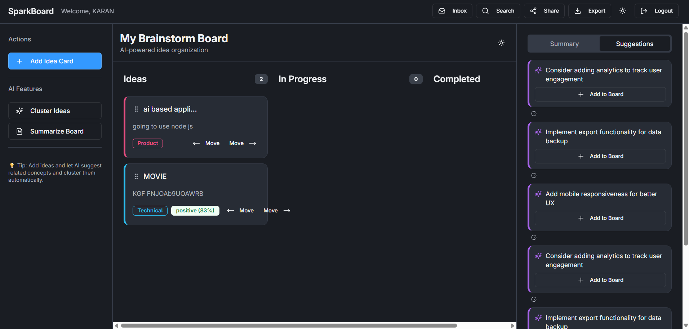

## SparkBoard

Collaborative, AI-assisted brainstorming board with sharing, inbox notifications, and idea management.

### Screenshot


### Prerequisites
- Node.js 18+ and npm
- SQLite (bundled via libsql client, no separate install required)

### Install
```bash
npm install
```

### Configure (optional)
Environment variables are optional. By default the app uses a local SQLite database at `file:./dev.db`.

- `DATABASE_URL` (optional): set to a libsql/sqlite URL. Example:
```bash
set DATABASE_URL=file:./dev.db    # Windows PowerShell
# or
export DATABASE_URL=file:./dev.db # macOS/Linux
```

### Initialize/Update Database Schema
Run migrations to ensure all tables exist (including shared inbox):
```bash
npm run db:push
```

This will sync the schema defined in `shared/schema.ts` (including `users`, `boards`, `ideas`, `suggestions`, `board_shares`, `idea_moods`, `shared_items`).

### Run in Development
```bash
npm run dev
```
This starts the Express server and the Vite client in the same process (proxied). Open the printed URL in your browser.

### Build and Start (Production)
```bash
npm run build
npm start
```

### App Overview
- Single-board brainstorm UI with columns: Ideas, In Progress, Completed
- AI features: clustering, summary, suggestions, mood analysis
- Board sharing: share full board with roles (viewer/editor)
- Item sharing: share a specific idea to another user’s inbox

### Authentication
- Simple username/password form
- Session stored via `express-session`

### Sharing a Board (owner → recipient)
1. As the owner, open your board.
2. Click “Share” in the header.
3. Enter recipient username and choose role (viewer/editor).
4. Recipient can now access the shared board (the app’s `/api/board` returns an accessible board for the logged-in user).

### Sharing a Specific Idea (owner → recipient inbox)
1. As the owner, on any idea card click the Share icon.
2. Enter the exact recipient username.
3. The server creates a pending item in `shared_items` for the recipient.

### Viewing Inbox (recipient)
- Click the “Inbox” button in the header to open the panel.
- You’ll see pending items fetched from `GET /api/inbox`.
- Actions:
  - Accept: creates a new idea in your board and marks the item as accepted
  - Dismiss: hides the item and marks it dismissed

The board also polls the inbox every ~5 seconds and may show a popup for the first pending item.

### Useful API Commands
Replace placeholders (PORT/IDs/COOKIES) accordingly.

Create share item as owner:
```bash
curl -i -X POST http://localhost:PORT/api/share-item \
  -H "Content-Type: application/json" \
  -H "Cookie: OWNER_SESSION_COOKIE" \
  -d '{"recipientUsername":"RECIPIENT","sourceBoardId":"OWNER_BOARD_ID","title":"Hello","content":"World"}'
```

Recipient inbox list:
```bash
curl -s http://localhost:PORT/api/inbox -H "Cookie: RECIPIENT_SESSION_COOKIE"
```

Accept an inbox item:
```bash
curl -i -X POST http://localhost:PORT/api/inbox/ITEM_ID/accept -H "Cookie: RECIPIENT_SESSION_COOKIE"
```

### Troubleshooting
- Inbox empty but you shared an item:
  - Ensure you ran `npm run db:push` after pulling changes.
  - Confirm POST `/api/share-item` returns 200 in the owner’s Network tab.
  - Confirm GET `/api/inbox` returns items for the recipient in Network tab.
  - Check usernames are exact (no spaces/casing issues).

- Recipient can’t see a board that was shared:
  - Ensure the owner shared with the correct username and role.
  - Recipient should log out/in if session changed.

### Project Structure (key files)
- `client/src/pages/Board.tsx`: main board UI, inbox panel, dialogs
- `client/src/components/IdeaCard.tsx`: idea card with share/mood/edit actions
- `server/routes.ts`: API routes (auth, board, ideas, sharing, inbox)
- `server/storage.ts`: data access with Drizzle ORM
- `shared/schema.ts`: database schema (all tables)

### License
MIT


